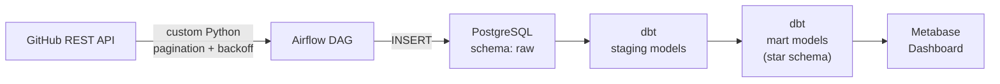
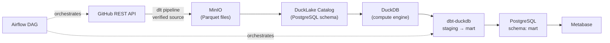
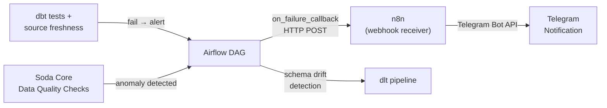

# Rancangan Proyek Portofolio: Data Engineering Lakehouse Pipeline

Proyek ini dirancang sebagai satu repository dengan progresi arsitektur bertahap (Fase 1 → 2 → 3), bukan tiga proyek terpisah. Tujuannya: menunjukkan kemampuan mendesain dan memigrasikan arsitektur, bukan sekadar menjalankan tutorial.

## Arsitektur Tingkat Tinggi

Diagram berikut menunjukkan evolusi arsitektur dari Fase 1 ke Fase 3. Setiap fase membangun di atas fondasi fase sebelumnya.

### Fase 1 — Batch ELT Baseline



### Fase 2 — Lakehouse Migration



### Fase 3 — Data Quality, Monitoring & Alerting



---

## Keputusan Teknis (Locked)

Poin-poin berikut sudah diputuskan agar rancangan bisa langsung dieksekusi tanpa keputusan menggantung di tengah jalan.

| Area | Keputusan | Alasan |
|---|---|---|
| Transformation tool | **dbt-core** (Fase 1 dengan `dbt-postgres`, Fase 2 dengan `dbt-duckdb`) | Komunitas dan referensi jauh lebih besar dibanding SQLMesh, lebih dikenali recruiter/interviewer, lebih mudah dipertahankan argumennya saat wawancara. SQLMesh tetap dicatat sebagai eksplorasi opsional (lihat Fase 2), bukan pilihan utama |
| Sumber data | **GitHub REST API** (mis. events/issues/pull requests dari satu organisasi publik) | API nyata dengan pagination, rate limiting (perlu backoff strategy), dan field `updated_at` untuk incremental load — tantangan data engineering yang otentik, bukan simulasi dummy data |
| Secrets management | `.env` + `python-dotenv` (lokal), `.env.example` di-commit sebagai referensi, `.env` masuk `.gitignore` | Standar minimum agar credential tidak ter-commit ke repo publik, tanpa overhead vault/secret manager yang overkill untuk proyek solo |
| Testing strategy | **Multi-layer**: pytest untuk DAG integrity + unit test callable; dbt test (`not_null`, `unique`, `relationships`) + dbt unit test (logic SQL); dlt schema validation; idempotency test; data quality checks (Fase 3) | Coverage di empat layer berbeda (orchestration, transformation, ingestion, data quality) menunjukkan testing bukan cuma tempelan di satu tempat |
| Lakehouse layer (Fase 2) | **DuckLake** (table format) + **DuckDB** (compute engine) — keduanya dipakai bersama, bukan salah satu | DuckLake v1.0 (production-ready, April 2026) menyediakan ACID transactions dan catalog metadata di atas Parquet. DuckDB sebagai compute engine embedded. Keduanya *complementary*: DuckLake = format + catalog, DuckDB = query engine. Katalog DuckLake disimpan di PostgreSQL (instance yang sudah ada), menghindari tambahan infrastruktur |
| Metabase connection (Fase 2) | Metabase tetap terhubung ke **PostgreSQL `mart` schema** — dbt menulis hasil transformasi akhir ke PostgreSQL, bukan langsung ke DuckDB | Metabase tidak punya native DuckDB driver (perlu community driver dengan risiko version mismatch). Pendekatan ini zero-friction dan lebih stabil. DuckDB/DuckLake dipakai sebagai compute layer internal, PostgreSQL `mart` sebagai serving layer |
| Data modeling | **Dimensional modeling** (star schema) di mart layer: fact tables (`fct_pull_requests`, `fct_issues`) + dimension tables (`dim_repos`, `dim_users`, `dim_labels`) | Menunjukkan pemahaman modeling approach yang bisa dipertanyakan saat interview (kenapa star schema vs OBT, kenapa grain dipilih demikian, dll) |
| Resource footprint | Airflow **LocalExecutor**, **satu instance PostgreSQL** dengan skema terpisah (`airflow_meta`, `raw`, `staging`, `mart`, `ducklake_catalog`) — servis dijalankan bertahap sesuai fase yang sedang dikerjakan (tidak semua service hidup bersamaan sejak awal) | Proyek solo di laptop biasa perlu footprint resource serendah mungkin tanpa mengorbankan kejelasan arsitektur |
| Dependency management | **`requirements.txt`** dengan versi pinned untuk setiap dependency (`dbt-core==X.Y.Z`, `dlt[filesystem,parquet]==X.Y.Z`, `apache-airflow==X.Y.Z`). Docker image juga di-pin versinya (bukan `:latest`) | Reproducibility — siapa pun yang clone repo harus bisa menjalankan pipeline dengan hasil yang konsisten |
| Git strategy | Branch per fase (`fase-1/baseline`, `fase-2/lakehouse`, `fase-3/data-quality`), merge ke `main` saat fase selesai, tag release (`v1.0-baseline`, `v2.0-lakehouse`, `v3.0-data-quality`) | Menunjukkan engineering discipline dan memudahkan reviewer melihat evolusi arsitektur melalui git history |
| Data quality tool (Fase 3) | **Soda Core** (open source, Apache 2.0) | Lebih ringan dan cepat setup dibanding Great Expectations. Interface deklaratif (YAML/SodaCL) — cocok untuk proyek solo yang butuh data quality checks tanpa overhead scaffolding besar. Jika butuh validasi custom yang sangat kompleks di kemudian hari, bisa ditambahkan Great Expectations secara inkremental |
| Notification routing (Fase 3) | **n8n** (self-hosted, Sustainable Use License) sebagai notification router — menerima webhook dari Airflow, memformat pesan, mengirim ke Telegram | Memisahkan *notification logic* dari *pipeline logic*: Airflow hanya perlu HTTP POST ke satu endpoint, n8n yang mengatur formatting, routing, dan retry ke Telegram. Jika nanti perlu tambah channel (Slack, Email, Discord), cukup edit flow di n8n tanpa sentuh kode Airflow. Juga menunjukkan pemahaman separation of concerns antara orchestration dan notification |
| Lisensi repository | **MIT License** untuk kode milik sendiri, dengan catatan eksplisit di README bahwa n8n dipakai sebagai runtime dependency di bawah *Sustainable Use License* (bukan bagian dari kode yang didistribusikan ulang) | MIT adalah default paling permisif dan paling umum untuk proyek portofolio; disclaimer n8n mencegah kesalahpahaman soal lisensi proyek secara keseluruhan |

---

## Fase 1 — Fondasi: Batch ELT Konvensional

**Tujuan**: Membangun pipeline ELT dasar yang solid sebagai baseline arsitektur sebelum dimigrasikan ke lakehouse.

### Stack
- Apache Airflow (orchestrator, LocalExecutor)
- PostgreSQL (satu instance, skema terpisah: `airflow_meta`, `raw`, `staging`, `mart`)
- dbt-core + dbt-postgres (transformasi, testing, dokumentasi lineage)
- Metabase Open Source (dashboard/consumption layer)
- Docker Compose (environment)

### Cakupan Kerja

#### Setup & Infrastruktur
- [ ] Setup Docker Compose: `airflow-webserver`, `airflow-scheduler`, `postgres`, `metabase` — semua image di-pin versinya
- [ ] Setup `.env` + `.env.example` untuk kredensial, pastikan `.env` masuk `.gitignore`. Variabel minimal:
  - `GITHUB_API_TOKEN` — untuk akses GitHub REST API
  - `POSTGRES_USER`, `POSTGRES_PASSWORD`, `POSTGRES_DB` — kredensial PostgreSQL
  - `DEMO_MODE=false` — set `true` untuk jalankan pipeline tanpa GitHub token
  - *(Fase 2 nanti tambahkan: `MINIO_ACCESS_KEY`, `MINIO_SECRET_KEY`)*
  - *(Fase 3 nanti tambahkan: `N8N_WEBHOOK_URL`, `TELEGRAM_BOT_TOKEN`, `TELEGRAM_CHAT_ID`)*
- [ ] Buat `requirements.txt` dengan semua dependency di-pin versinya
- [ ] Buat `Makefile` dengan target: `setup`, `up`, `down`, `test`, `test-dbt`, `test-dag`, `seed`, `lint`

#### Ingestion
- [ ] Sumber data: GitHub REST API — pilih satu organisasi/repo publik, ambil endpoint events/issues/pull requests
- [ ] Buat DAG ingestion: idempotent, retry policy, tangani rate limiting GitHub API (backoff strategy), gunakan field `updated_at` untuk incremental load
- [ ] Desain interface ingestion script yang modular (function-based, bukan monolithic script) — agar migrasi ke dlt di Fase 2 terasa natural, bukan rewrite total
- [ ] Sediakan sample seed data di `data/seed/` (snapshot JSON dari GitHub API response) dan buat mode `DEMO_MODE` di DAG: jika env var `DEMO_MODE=true`, skip API call dan load dari seed data — untuk testing dan agar reviewer bisa menjalankan pipeline tanpa GitHub token

#### Data Modeling & Transformation
- [ ] Desain skema `raw` → `staging` → `mart` di PostgreSQL
- [ ] Terapkan dimensional modeling di mart layer: fact tables (`fct_pull_requests`, `fct_issues`) + dimension tables (`dim_repos`, `dim_users`, `dim_labels`)
- [ ] Buat dbt models:
  - staging: 3-4 model (`stg_pull_requests`, `stg_issues`, `stg_events`, `stg_users`)
  - mart: 2-3 model (fact + dimension tables)
- [ ] Tambahkan dbt test bawaan: `not_null`, `unique`, `relationships` di setiap model
- [ ] Tambahkan dbt unit test (built-in sejak dbt-core 1.8+): test logic SQL transformation secara isolated (input mock → output expected) — minimal 2 unit test untuk model yang punya logic non-trivial
- [ ] Tambahkan dbt documentation (lineage graph) + deskripsi kolom di `schema.yml`

#### Testing
- [ ] Tulis unit test (pytest) untuk DAG integrity (import test tanpa error, tidak ada cyclic dependency)
- [ ] Tulis unit test (pytest) untuk custom Python callable yang menangani pagination/backoff
- [ ] Tulis idempotency test: jalankan DAG dua kali dengan data yang sama, verifikasi tidak ada duplikasi di `raw` layer
- [ ] Pastikan semua test bisa dijalankan via `make test` tanpa perlu koneksi ke GitHub API (gunakan seed data / mock)

#### Consumption & Dokumentasi
- [ ] Buat 1-2 dashboard dasar di Metabase dari mart layer
- [ ] Buat architecture diagram Fase 1 (Mermaid di `docs/architecture-v1.md`)
- [ ] Tulis README bagian 1: penjelasan arsitektur baseline dan alasan setiap pilihan desain (kenapa skema dipisah, kenapa DAG dibuat idempotent, kenapa GitHub API dipilih sebagai sumber data, kenapa dimensional modeling, dll)

### Kriteria Selesai
Pipeline berjalan end-to-end tanpa intervensi manual, dbt test (termasuk unit test) lolos semua, idempotency test lolos, dashboard menampilkan data yang benar dari hasil transformasi, dan pipeline bisa dijalankan dalam `DEMO_MODE` tanpa GitHub token.

---

## Fase 2 — Migrasi ke Lakehouse Layer

**Tujuan**: Refactor arsitektur Fase 1 menjadi lakehouse mini, sambil mendokumentasikan alasan migrasi.

### Stack Tambahan
- dlt (data load tool) — menggantikan script ingestion custom, menggunakan verified source untuk GitHub API
- MinIO (S3-compatible object storage) — raw storage sebagai Parquet
- DuckLake v1.0 (open table format) — catalog metadata disimpan di PostgreSQL skema `ducklake_catalog`, data files (Parquet) di MinIO
- DuckDB (compute engine, embedded/in-process) — query execution layer
- dbt-core + dbt-duckdb (lanjutan dari Fase 1, adapter diganti dari `dbt-postgres` ke `dbt-duckdb`)

### Catatan Arsitektur: DuckLake + DuckDB

DuckLake dan DuckDB bukan alternatif — keduanya *complementary*:

| Komponen | Peran | Analogi |
|---|---|---|
| **MinIO** | Data storage (Parquet files) | "Hard disk" — tempat data fisik tersimpan |
| **DuckLake** | Table format + catalog | "File system" — metadata, skema tabel, ACID transactions |
| **DuckDB** | Compute engine | "CPU" — eksekusi query |
| **PostgreSQL** | DuckLake catalog database | "Registry" — tempat DuckLake menyimpan metadata tabel |

DuckLake menyimpan catalog-nya di PostgreSQL (instance yang sudah ada, skema `ducklake_catalog`), sehingga **tidak ada tambahan infrastruktur**. Ini juga **menyelesaikan masalah single-writer DuckDB** — multiple DuckDB instances bisa read/write ke dataset yang sama dengan koordinasi melalui catalog PostgreSQL.

### Cakupan Kerja

#### Setup & Migrasi Ingestion
- [ ] Setup MinIO di Docker Compose (pin image version)
- [ ] Ganti ingestion script Fase 1 dengan dlt pipeline:
  - Gunakan `dlt init github` (verified source) atau `rest_api_source` untuk konfigurasi custom
  - Destination: `filesystem` ke MinIO, format Parquet (`loader_file_format="parquet"`)
  - Konfigurasi: `.dlt/config.toml` dengan `endpoint_url` MinIO
- [ ] Tambahkan schema validation di dlt pipeline (schema evolution detection — pastikan skema sumber tidak berubah diam-diam, alert jika ada field baru/hilang)
- [ ] Update `DEMO_MODE`: seed data sekarang berupa Parquet files di MinIO (bukan JSON di PostgreSQL)

#### Setup Lakehouse Layer
- [ ] Setup DuckLake catalog di PostgreSQL skema `ducklake_catalog`
- [ ] Konfigurasi DuckDB agar terhubung ke DuckLake catalog (PostgreSQL) dan data files (MinIO)
- [ ] Dokumentasikan bagaimana DuckLake menangani concurrency (bukan lagi workaround single-writer manual) — jelaskan mekanisme ACID melalui SQL catalog

#### Transformasi & Serving
- [ ] Migrasikan dbt models dari `dbt-postgres` ke `dbt-duckdb`:
  - Update `profiles.yml` untuk DuckDB connection
  - Sesuaikan SQL syntax jika ada perbedaan (PostgreSQL vs DuckDB)
  - Pastikan semua dbt test tetap lolos setelah migrasi
- [ ] Konfigurasi dbt agar menulis hasil mart ke PostgreSQL `mart` schema (serving layer untuk Metabase)
- [ ] Tambahkan `dbt source freshness` — verifikasi raw data tidak stale
- [ ] Update dashboard Metabase (tetap terhubung ke PostgreSQL `mart` schema — zero migration di sisi Metabase)

#### Testing & Dokumentasi
- [ ] Tambahkan integration test: end-to-end dari dlt ingestion → DuckLake → dbt → PostgreSQL mart, verifikasi row count dan value range
- [ ] Tambahkan data contract test: verifikasi bahwa schema API GitHub tidak berubah antara run (dlt schema evolution + custom assertion)
- [ ] **(Opsional, nilai tambah)** Eksplorasi singkat SQLMesh di branch terpisah — coba migrasikan 1-2 model, dokumentasikan pengalaman nyata soal virtual environment testing dan incremental rebuild dibanding dbt. Tidak menggantikan dbt sebagai stack utama, hanya sebagai bukti eksplorasi teknologi
- [ ] Buat architecture diagram Fase 2 (Mermaid di `docs/architecture-v2.md`) — tunjukkan perbandingan sebelum/sesudah
- [ ] Tulis README bagian 2: perbandingan arsitektur sebelum/sesudah migrasi, trade-off yang diambil, penjelasan peran masing-masing komponen (DuckLake vs DuckDB vs MinIO), dan alasan kenapa lakehouse layer lebih sesuai untuk skenario proyek ini

### Kriteria Selesai
Pipeline Fase 1 berjalan penuh di atas lakehouse layer (MinIO + DuckLake + DuckDB), dbt test dan dbt source freshness lolos, integration test lolos, Metabase dashboard menampilkan data yang sama seperti Fase 1, dan README menjelaskan migrasi dengan detail teknis yang bisa dipertanggungjawabkan saat ditanya.

---

## Fase 3 — Data Quality, Monitoring & Alerting

**Tujuan**: Menambahkan lapisan data quality, monitoring, dan alerting di atas pipeline yang sudah ada, menunjukkan pemahaman bahwa pipeline yang "jalan" belum tentu pipeline yang "sehat", serta mendemonstrasikan separation of concerns antara orchestration (Airflow) dan notification routing (n8n).

### Stack Tambahan
- Soda Core (open source, Apache 2.0) — data quality checks, deklaratif via YAML/SodaCL
- n8n (self-hosted, Sustainable Use License) — notification router: menerima webhook dari Airflow, memformat pesan, mengirim ke Telegram
- Telegram Bot API — notification channel (via n8n)

### Arsitektur Alerting: Airflow → n8n → Telegram

Pembagian tanggung jawab yang jelas:

| Komponen | Tanggung Jawab | Tidak Bertanggung Jawab Atas |
|---|---|---|
| **Airflow** | Mendeteksi kegagalan (DAG failure, data quality failure), mengirim HTTP POST ke webhook n8n dengan payload JSON | Formatting pesan, interaksi langsung dengan Telegram API, retry notification |
| **n8n** | Menerima webhook, memformat pesan (Markdown), routing ke Telegram, retry jika Telegram API down | Menjalankan pipeline, mendeteksi anomali data, scheduling |
| **Telegram** | Delivery notifikasi ke user | — |

Kenapa pakai n8n, bukan langsung Airflow → Telegram?
1. **Separation of concerns**: Notification logic tidak tersebar di setiap DAG — satu perubahan format pesan cukup di n8n, tanpa redeploy Airflow
2. **Extensibility**: Jika nanti perlu tambah channel (Slack, Discord, Email), cukup edit flow n8n — Airflow tetap HTTP POST ke satu endpoint yang sama
3. **Portofolio value**: Menunjukkan pemahaman bahwa orchestrator seharusnya tidak bertanggung jawab atas notification delivery — ini prinsip yang jarang ditunjukkan di proyek portofolio

### Cakupan Kerja

#### Data Quality Checks (Soda Core)
- [ ] Setup Soda Core: install `soda-core-duckdb` dan `soda-core-postgres`, buat konfigurasi connection di `data_quality/configuration.yml`
- [ ] Buat data quality checks untuk raw layer (`data_quality/checks/raw.yml`):
  - Volume check: `row_count` per run tidak turun lebih dari 50% dari run sebelumnya
  - Freshness check: `max(updated_at)` tidak lebih lama dari 24 jam
  - Schema check: kolom yang diharapkan ada (`id`, `title`, `state`, `created_at`, `updated_at`), tipe data sesuai
- [ ] Buat data quality checks untuk mart layer (`data_quality/checks/mart.yml`):
  - Referential integrity: semua `user_id` di `fct_pull_requests` valid di `dim_users`
  - Value range: `duration_hours` tidak negatif, `created_at` tidak di masa depan
  - Completeness: persentase null di kolom `title`, `state`, `user_id` di bawah 1%
- [ ] Integrasikan Soda checks ke DAG Airflow sebagai task terpisah:
  - Task `soda_check_raw` → setelah ingestion, sebelum dbt run
  - Task `soda_check_mart` → setelah dbt run, sebelum "pipeline selesai"
  - Jika Soda check gagal → trigger `on_failure_callback` yang kirim ke n8n

#### n8n Setup & Notification Flow
- [ ] Setup n8n di Docker Compose (`docker-compose.fase3.yml`): image pinned, volume untuk persistence workflow
- [ ] Buat Telegram Bot via BotFather, simpan Bot Token dan Chat ID di `.env` (variabel `TELEGRAM_BOT_TOKEN`, `TELEGRAM_CHAT_ID`)
- [ ] Buat n8n workflow: **Pipeline Alert Flow**
  1. **Webhook node** (POST) — menerima payload JSON dari Airflow:
     ```json
     {
       "alert_type": "pipeline_failure" | "data_quality_failure" | "schema_drift",
       "dag_id": "github_elt_dag",
       "task_id": "soda_check_mart",
       "execution_date": "2026-08-13T10:00:00",
       "error_message": "Soda check failed: row_count dropped 60%",
       "severity": "critical" | "warning"
     }
     ```
  2. **IF node** — routing berdasarkan `alert_type`:
     - `pipeline_failure` → 🔴 format pesan dengan emoji merah
     - `data_quality_failure` → 🟡 format pesan dengan emoji kuning
     - `schema_drift` → 🟠 format pesan dengan emoji oranye
  3. **Telegram node** — kirim pesan Markdown ke chat ID yang dikonfigurasi, contoh output:
     ```
     🔴 *Pipeline Failure*
     DAG: `github_elt_dag`
     Task: `ingest_pull_requests`
     Time: 2026-08-13 10:00 UTC
     Error: GitHub API rate limit exceeded
     ```
- [ ] Export workflow n8n sebagai JSON di `n8n/workflows/pipeline-alert-flow.json`
- [ ] Buat Airflow callback function yang reusable:
  ```python
  # airflow/plugins/callbacks.py
  def send_alert_to_n8n(context, alert_type="pipeline_failure"):
      """Kirim alert ke n8n webhook. Satu fungsi untuk semua DAG."""
      webhook_url = os.getenv("N8N_WEBHOOK_URL")
      payload = {
          "alert_type": alert_type,
          "dag_id": context["task_instance"].dag_id,
          "task_id": context["task_instance"].task_id,
          "execution_date": str(context["execution_date"]),
          "error_message": str(context.get("exception", "Unknown error")),
          "severity": "critical" if alert_type == "pipeline_failure" else "warning"
      }
      requests.post(webhook_url, json=payload, timeout=10)
  ```
- [ ] Terapkan callback di semua DAG: `on_failure_callback=send_alert_to_n8n`

#### Schema Drift Detection
- [ ] Manfaatkan dlt schema evolution detection yang sudah ada dari Fase 2
- [ ] Jika dlt mendeteksi kolom baru/hilang, trigger alert ke n8n dengan `alert_type="schema_drift"`
- [ ] Dokumentasikan strategi penanganan schema drift: dlt otomatis evolve schema (menambahkan kolom baru), tapi alert tetap dikirim agar engineer aware — kolom yang hilang di-flag sebagai `critical`

#### Circuit Breaker (Opsional, Nilai Tambah)
- [ ] Buat mekanisme circuit breaker: jika Soda check gagal pada `severity=critical`, pipeline berhenti dan tidak refresh Metabase sampai ada investigasi
- [ ] Implementasi: task downstream dari Soda check menggunakan `BranchPythonOperator` — jika Soda gagal, branch ke `alert_and_stop`, jika lolos, branch ke `refresh_metabase`

#### Monitoring Dashboard (Opsional, Nilai Tambah)
- [ ] Buat dashboard monitoring di Metabase: pipeline run history, data quality score per run, row count trend per tabel
- [ ] Tambahkan `dbt source freshness` sebagai scheduled check harian (bukan hanya saat pipeline jalan)

#### Dokumentasi
- [ ] Buat architecture diagram Fase 3 (Mermaid di `docs/architecture-v3.md`)
- [ ] Tulis README bagian 3:
  - Penjelasan data quality strategy (apa yang dicek, kenapa threshold-nya dipilih demikian)
  - Penjelasan arsitektur alerting Airflow → n8n → Telegram (boundary masing-masing tool)
  - Contoh screenshot notifikasi Telegram yang diterima saat pipeline gagal
  - Disclaimer lisensi: n8n dipakai sebagai runtime dependency di bawah Sustainable Use License
- [ ] Dokumentasikan setiap Soda check — apa yang dicek, threshold, dan action jika gagal

### Kriteria Selesai
Soda Core checks berjalan otomatis di dalam DAG Airflow setelah setiap pipeline run, kegagalan pipeline dan anomali data ter-notifikasi otomatis ke Telegram melalui n8n tanpa intervensi manual, notifikasi terkategorisasi berdasarkan severity (🔴 pipeline failure / 🟡 data quality / 🟠 schema drift), schema drift terdeteksi dan ter-alert, workflow n8n ter-export sebagai JSON di repo, dan README menjelaskan pembagian peran Airflow (orchestration + detection) vs n8n (notification routing) dengan jelas.

---

## Catatan: Strategi Docker Compose Per Fase

Rancangan ini baru berupa checklist kerja, belum implementasi. Saat masuk tahap eksekusi, `docker-compose.yml` **dibuat terpisah per fase**, bukan satu file besar berisi semua service sejak awal — konsisten dengan keputusan resource footprint yang sudah dikunci (servis dijalankan bertahap, tidak semua hidup bersamaan sejak awal).

Pendekatan yang dipakai: base file + override per fase.

```
project-root/
├── docker-compose.yml            # base: Airflow, PostgreSQL, Metabase (Fase 1)
├── docker-compose.fase2.yml      # tambahan: MinIO (Fase 2)
├── docker-compose.fase3.yml      # tambahan: n8n (notification router untuk Telegram)
```

Cara menjalankan sesuai fase yang sedang dikerjakan:

```bash
# Fase 1 saja
docker compose -f docker-compose.yml up -d

# Fase 1 + Fase 2
docker compose -f docker-compose.yml -f docker-compose.fase2.yml up -d

# Fase 1 + Fase 2 + Fase 3 (full stack)
docker compose -f docker-compose.yml -f docker-compose.fase2.yml -f docker-compose.fase3.yml up -d
```

Catatan tambahan:
- DuckDB tidak butuh service container sendiri — sifatnya embedded/in-process, dipanggil sebagai library langsung dari Airflow task atau dbt, bukan server yang berjalan terus-menerus.
- DuckLake catalog disimpan di PostgreSQL yang sudah ada (skema `ducklake_catalog`), tidak butuh container tambahan.
- Setiap file compose per fase didokumentasikan alasannya di `docs/architecture-vX.md` yang bersangkutan (service apa yang ditambahkan, kenapa dipisah, dependency ke fase sebelumnya).

---

## Struktur Repository (Referensi)

```
project-root/
├── docker-compose.yml
├── docker-compose.fase2.yml
├── docker-compose.fase3.yml
├── .env.example                   # template, .env asli masuk .gitignore
├── .gitignore
├── LICENSE                        # MIT
├── Makefile                       # target: setup, up, down, test, test-dbt, test-dag, seed, lint
├── requirements.txt               # semua Python dependency, versi pinned
│
├── airflow/
│   ├── dags/
│   │   └── github_elt_dag.py
│   ├── plugins/
│   │   └── callbacks.py           # reusable callback: send_alert_to_n8n() (Fase 3)
│   └── config/
│
├── data/
│   └── seed/                      # sample data untuk DEMO_MODE (JSON/Parquet snapshots)
│
├── dbt/
│   ├── dbt_project.yml
│   ├── profiles.yml
│   ├── models/
│   │   ├── staging/
│   │   │   ├── stg_pull_requests.sql
│   │   │   ├── stg_issues.sql
│   │   │   ├── stg_events.sql
│   │   │   └── schema.yml
│   │   └── marts/
│   │       ├── fct_pull_requests.sql
│   │       ├── fct_issues.sql
│   │       ├── dim_repos.sql
│   │       ├── dim_users.sql
│   │       ├── dim_labels.sql
│   │       └── schema.yml
│   ├── tests/                     # dbt singular tests (jika ada)
│   └── macros/
│
├── dlt/
│   ├── pipelines/
│   └── .dlt/
│       ├── config.toml
│       └── secrets.toml           # masuk .gitignore
│
├── tests/                         # pytest: DAG integrity, unit test, idempotency, integration
│   ├── test_dag_integrity.py
│   ├── test_ingestion.py
│   ├── test_idempotency.py
│   └── conftest.py
│
├── data_quality/                  # Soda Core config + checks
│   ├── configuration.yml          # Soda connection config (DuckDB, PostgreSQL)
│   └── checks/
│       ├── raw.yml                # checks untuk raw layer (volume, freshness, schema)
│       └── mart.yml               # checks untuk mart layer (integrity, range, completeness)
│
├── n8n/
│   └── workflows/
│       └── pipeline-alert-flow.json   # export workflow n8n (version controlled)
│
├── sqlmesh-exploration/           # opsional, branch/folder terpisah, non-blocking
│
├── docs/
│   ├── architecture-v1.md         # Fase 1 (diagram + penjelasan)
│   ├── architecture-v2.md         # Fase 2 (migrasi, perbandingan sebelum/sesudah)
│   ├── architecture-v3.md         # Fase 3 (data quality, n8n alerting)
│   └── self-evaluation/           # evaluasi diri per fase
│
└── README.md                      # ringkasan + architecture diagram + quick start + link ke docs/ + disclaimer lisensi n8n
```

---

## Strategi Reproducibility

Agar reviewer/interviewer bisa menjalankan proyek ini tanpa hambatan:

1. **Seed data**: Sampel response GitHub API disimpan di `data/seed/`. Pipeline bisa dijalankan dalam `DEMO_MODE` tanpa perlu GitHub token
2. **Version pinning**: Semua dependency (Python packages + Docker images) di-pin versinya
3. **Makefile**: Satu entry point untuk semua operasi umum — `make setup && make up && make seed`
4. **Quick start di README**: Maksimal 3 langkah untuk menjalankan pipeline dari nol

```bash
# Quick start (3 langkah)
git clone https://github.com/username/elt-to-lakehouse.git
cp .env.example .env        # edit jika perlu, atau langsung pakai DEMO_MODE
make up && make seed         # jalankan pipeline dengan sample data
```

---

## Strategi Git & Branching

```
main ─────────────────────────────────────────────────────────►
  │                    │                         │
  └─ fase-1/baseline ─┘                         │
           (merge + tag v1.0-baseline)           │
                       │                         │
                       └─ fase-2/lakehouse ──────┘
                                (merge + tag v2.0-lakehouse)
                                                 │
                                                 └─ fase-3/data-quality
                                                        (merge + tag v3.0-data-quality)
```

- Setiap fase dikerjakan di branch terpisah
- Merge ke `main` saat fase selesai dan semua test lolos
- Tag release di setiap milestone
- Commit message deskriptif (conventional commits: `feat:`, `fix:`, `docs:`, `test:`)

---

## Catatan Evaluasi Diri (isi setelah setiap fase)

Untuk setiap fase, sebelum lanjut ke fase berikutnya, jawab pertanyaan berikut secara tertulis di `docs/self-evaluation/`:

1. Apa keputusan desain yang paling sulit di fase ini, dan kenapa?
2. Kalau harus jelaskan arsitektur ini ke orang lain dalam 2 menit tanpa membuka kode, apa yang akan disampaikan?
3. Trade-off apa yang disadari sudah diambil, dan alternatif apa yang tidak dipilih?
4. Bug atau masalah teknis apa yang ditemui selama pengerjaan, dan bagaimana penyelesaiannya?
5. Jika mengulang fase ini dari awal, apa yang akan dilakukan berbeda?

Bagian ini penting sebagai bukti pemahaman, bukan hanya eksekusi — akan jadi bahan utama saat proyek ini dibahas di wawancara.
