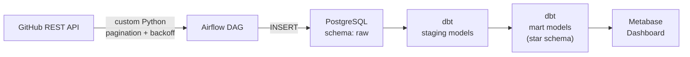

# Arsitektur Fase 1: Batch ELT Baseline

Fase 1 dari *ELT to Lakehouse* pipeline mengimplementasikan pendekatan *Batch ELT* konvensional. Pipeline ini menjadi fondasi sebelum dimigrasikan ke arsitektur *Lakehouse* di Fase 2.

## Diagram Arsitektur

## Komponen Utama

1. **Ingestion Layer (Python + Airflow)**
   - Mengekstrak data statis dari GitHub REST API.
   - Mendukung metode *pagination* dan pencegahan *rate limit* menggunakan *exponential backoff*.
   - Data dimuat ke tabel `pull_requests` dan `issues` di skema `raw` pada PostgreSQL.
   - *DEMO_MODE* tersedia untuk melakukan load data dari sampel JSON tanpa koneksi API nyata.

2. **Storage Layer (PostgreSQL)**
   - Satu *instance* PostgreSQL digunakan dengan pembagian skema logis:
     - `airflow_meta`: Metadata untuk Airflow.
     - `raw`: Menyimpan data JSON mentah.
     - `staging`: Tabel referensi dbt untuk pembersihan data.
     - `mart`: Tabel dimensi dan fakta.

3. **Transformation Layer (dbt-postgres)**
   - Menerapkan arsitektur dimensional (Star Schema).
   - Memisahkan data mentah menjadi `fct_pull_requests`, `fct_issues`, `dim_users`, dan `dim_labels`.

4. **Serving & Visualization Layer (Metabase)**
   - Tersambung langsung ke skema `mart` pada PostgreSQL untuk membuat *dashboard* analitik.
