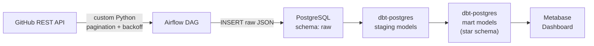
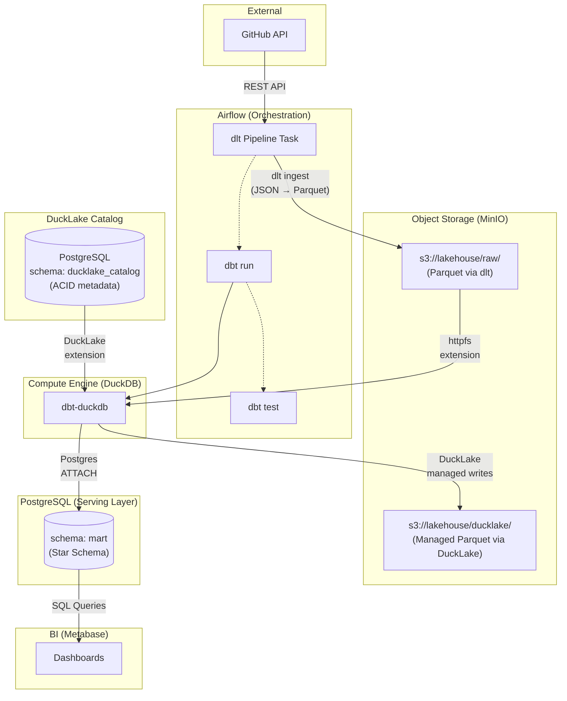

# Architecture Fase 2: Lakehouse Migration

## Perbandingan Arsitektur: Fase 1 vs Fase 2

### Fase 1 — Batch ELT Baseline

**Karakteristik Fase 1:**
- Satu database (PostgreSQL) menangani semuanya: raw storage, compute, serving
- Data mentah disimpan sebagai JSON di kolom PostgreSQL
- dbt-postgres melakukan transformasi langsung di database yang sama
- Sederhana, tapi tidak scalable — PostgreSQL menjadi bottleneck

---

### Fase 2 — Lakehouse Migration

**Karakteristik Fase 2:**
- **Separation of concerns**: Storage (MinIO), Catalog (DuckLake/PostgreSQL), Compute (DuckDB), Serving (PostgreSQL mart)
- Raw data di MinIO dalam format Parquet yang efisien (bukan JSON di database)
- DuckLake menyediakan **ACID transactions** dan **catalog metadata** di atas Parquet files
- DuckDB sebagai in-memory compute engine yang membaca dari MinIO via httpfs
- PostgreSQL hanya berfungsi sebagai serving layer (mart schema) untuk Metabase — zero-migration di sisi BI

---

## Komponen dan Perannya

| Komponen | Peran | Analogi |
|---|---|---|
| **MinIO** | Data storage (Parquet files) | "Hard disk" — tempat data fisik tersimpan |
| **DuckLake** | Table format + catalog | "File system" — metadata, skema tabel, ACID transactions |
| **DuckDB** | Compute engine | "CPU" — eksekusi query |
| **PostgreSQL** (ducklake_catalog) | DuckLake catalog database | "Registry" — tempat DuckLake menyimpan metadata tabel |
| **PostgreSQL** (mart) | Serving layer | "Etalase" — tabel agregasi siap pakai untuk Metabase |

## Deskripsi Arsitektur

Fase 2 memigrasikan penyimpanan raw data dari database operasional (PostgreSQL) ke Object Storage (MinIO) dalam format Parquet, membentuk arsitektur Lakehouse yang lebih scalable.

**Ingestion**: `dlt` (data load tool) mengekstrak data dari GitHub API dan meloadnya langsung ke MinIO sebagai file Parquet (`s3://lakehouse/raw/`).

**Lakehouse Layer**: DuckLake v1.0 bertindak sebagai *table format* yang menyimpan catalog metadata di PostgreSQL (skema `ducklake_catalog`) dan mengelola data files di MinIO (`s3://lakehouse/ducklake/`). DuckLake menyediakan ACID transactions dan menyelesaikan masalah single-writer DuckDB — multiple DuckDB instances bisa read/write ke dataset yang sama dengan koordinasi melalui catalog PostgreSQL.

**Compute Layer**: DuckDB berjalan *in-memory* sebagai compute engine, membaca Parquet dari MinIO melalui `httpfs` extension. Semua transformasi dbt dieksekusi di DuckDB tanpa membebani PostgreSQL.

**Serving Layer**: Hasil transformasi akhir (mart tables) dimaterialisasikan ke PostgreSQL `mart` schema melalui DuckDB `ATTACH` command. Metabase tetap terhubung ke PostgreSQL tanpa perubahan konfigurasi.

## Concurrency Handling (DuckLake)

DuckLake menangani concurrency melalui mekanisme SQL-based catalog:
- **Metadata Locking**: DuckLake menggunakan PostgreSQL sebagai catalog store, sehingga mekanisme locking PostgreSQL (row-level locks, MVCC) otomatis berlaku untuk operasi metadata
- **ACID Transactions**: Setiap write operation melalui DuckLake adalah atomic — metadata dan data files diperbarui dalam satu transaksi
- **Multi-reader**: Multiple DuckDB instances dapat membaca data secara bersamaan tanpa blocking
- **Snapshot Isolation**: Reader selalu mendapatkan konsisten snapshot dari data, bahkan saat writer sedang memperbarui
