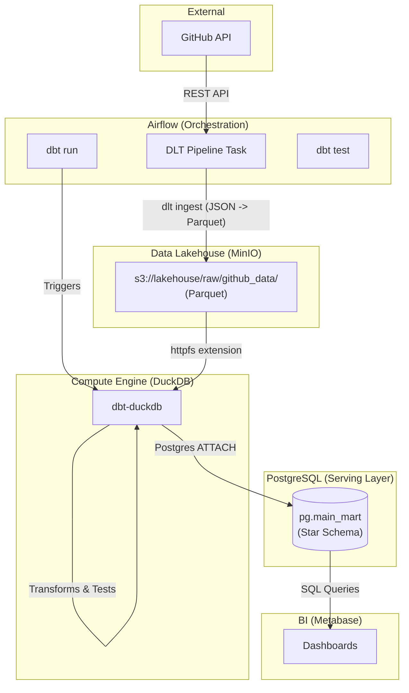

# Architecture Fase 2: Lakehouse Migration

## Deskripsi Arsitektur
Fase 2 memigrasikan penyimpanan raw data dari database operasional (PostgreSQL) ke Object Storage (MinIO) dalam format Parquet, membentuk arsitektur Lakehouse yang lebih scalable.
Compute layer dipisahkan dari storage layer. `dlt` (data load tool) digunakan untuk mengekstrak data dari GitHub API dan meloadnya langsung ke MinIO.
`dbt-duckdb` kemudian digunakan sebagai in-memory analytical database yang membaca Parquet file dari MinIO menggunakan `httpfs` extension, melakukan transformasi dbt in-memory, dan langsung menulis hasil akhir (Mart Tables) kembali ke PostgreSQL (sebagai serving layer) menggunakan fitur `ATTACH` di DuckDB. 
Ini mengoptimalkan proses transformasi dan memastikan serving layer di PostgreSQL hanya berisi tabel-tabel agregasi siap pakai tanpa dibebani proses komputasi mentah.
